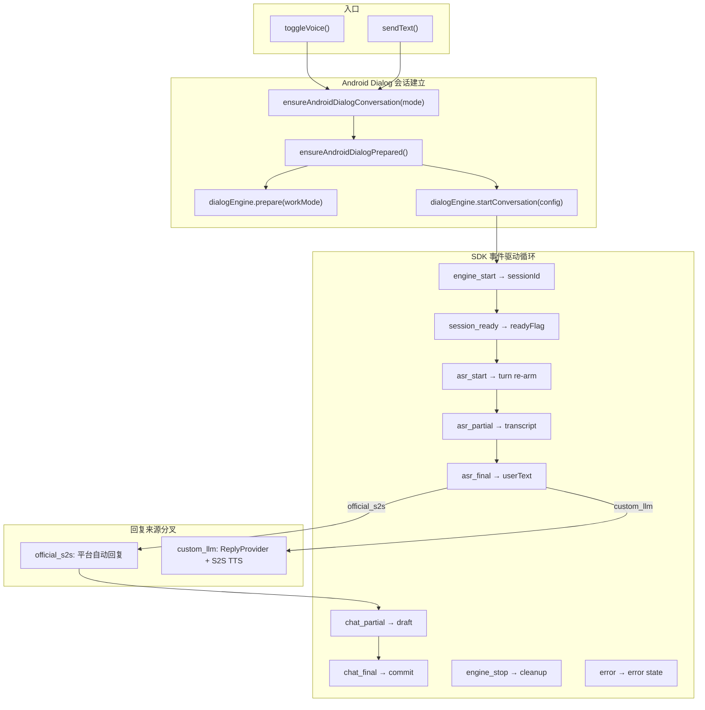

# 语音/聊天链路优化方案（Opus）

> 基于仓库代码深度分析，目标：稳定性 + 可维护性，不新增功能。
> 生成时间：2026-03-29

---

## A. 现状流程图（主干 + 分叉）

### 流程总览



### 流程 A：`official_s2s` + voice

```
用户 toggleVoice(start)
  → ensureAndroidDialogConversation('voice')
    → prepare(workMode='default') → startConversation(inputMode='audio')
  → setIsVoiceActive(true), voiceLoopActiveRef=true
  → 等待 SDK 事件:

[SDK] engine_start(sessionId) → 记录 androidDialogSessionIdRef
[SDK] session_ready        → androidDialogSessionReadyRef=true
[SDK] asr_start            → 清空 draft, phase=listening
[SDK] asr_partial(text)    → setLiveUserTranscript(text), state=hearing
[SDK] asr_final(text)      → appendMessage(user), state=awaiting_reply
[SDK] chat_partial(text)   → mergeAssistantDraft, phase=speaking
[SDK] chat_final(text)     → persistAssistantText, phase=listening

关键状态: androidDialogModeRef='voice', realtimeCallPhase, androidAssistantDraftRef
关键事件: engine_start → session_ready → [asr_start → asr_partial* → asr_final → chat_partial* → chat_final]*
```

### 流程 B：`official_s2s` + chat

```
用户 sendText(text)
  → appendMessage(user)
  → ensureAndroidDialogConversation('text', forceRestart=true)
    → prepare(workMode='default') → startConversation(inputMode='text')
  → dialogEngine.sendTextQuery(text)
  → 等待 SDK 事件:

[SDK] engine_start(sessionId) → 记录 session
[SDK] chat_partial(text)   → mergeAssistantDraft, pendingReply
[SDK] chat_final(text)     → persistAssistantText
                           → stopAndroidDialogConversation()
                           → status=idle

关键: 文本模式每轮 forceRestart，会话是短生命周期。
      chat_final 后主动 stop + 重置状态。
```

### 流程 C：`custom_llm` + voice（S2S 播报优先）

```
用户 toggleVoice(start)
  → ensureAndroidDialogConversation('voice')
    → prepare(workMode='delegate_chat_tts_text') ← 核心差异点
    → startConversation(inputMode='audio')
  → 等待 SDK 事件:

[SDK] engine_start(sessionId)
[SDK] session_ready
[SDK] asr_start → 每轮:
  ├─ 清空 draft/transcript
  ├─ 重置 clientTtsEnabled=false（强制 re-arm）
  ├─ 重置 platformReplyLeakGuard
  └─ armAndroidClientTriggeredTtsInBackground('asr_start')
      → ensureAndroidClientTriggeredTts (最多8次重试)
        → dialogEngine.useClientTriggeredTts()
        → 400061? → 视为已启用
        → 400060? → 重试
[SDK] asr_partial(text)  → transcript
[SDK] asr_final(text)    → userText 确定
  ├─ appendMessage(user)
  └─ runAndroidReplyFlow:
      ├─ ensureAndroidClientTriggeredTts(source='voice_round')
      │   (若 asr_start 预热成功则跳过)
      ├─ ReplyProvider.generateReplyStream(userText)
      │   → 流式: chunk → setPendingAssistantReply
      │   → 若 canStreamViaClientTts:
      │     → streamClientTtsText({ start, content, end })
      │     → phase=speaking
      │   → 若不可播:
      │     → interruptCurrentDialog() (尝试打断官方播报)
      │     → 文本仍然落库, hint="S2S语音播报未就绪"
      ├─ 生成完成: streamClientTtsText({ end:true })
      └─ persistAssistantText → syncConversationState

[SDK] chat_partial (custom_llm 模式下) → 视为泄漏事件
  → 首次: log warn + interruptCurrentDialog()
  → 后续: 静默丢弃
[SDK] chat_final (custom_llm 模式下) → 静默丢弃

关键状态:
  androidDialogClientTtsEnabledRef, androidDialogClientTtsArmingRef
  androidObservedPlatformReplyInCustomRef
  androidReplyGenerationRef (generation token, 用于抢占检测)
```

### 流程 D：`custom_llm` + chat

```
用户 sendText(text)
  → runTextRound (非 Android Dialog 文本链路)
    → appendMessage(user)
    → generateAssistantReplyFromProvider
      → ReplyProvider.generateReplyStream
      → 流式更新 pendingAssistantReply
    → appendMessage(assistant)
    → 不触发语音播报
    → status=idle

注意: custom_llm + chat 不走 Android Dialog SDK 的 sendTextQuery。
      直接走 ReplyProvider → 本地落库。
      useAndroidDialogTextRuntime = (isAndroidDialogMode && replyChainMode === 'official_s2s')
      所以 custom_llm 文本不走 Dialog SDK。
```

---

## B. 核心问题诊断（按优先级排序）

### P0-1：第二句有文本但无播音（custom_llm voice）

| 维度 | 内容 |
|------|------|
| **触发条件** | `custom_llm` + voice 模式，第一轮正常播报完成后，第二轮 `asr_start` 触发 re-arm，但 `useClientTriggeredTts` 在 SDK 内部因前一轮 TTS 未完全释放而返回 `400060`；重试次数耗尽后 `clientTtsEnabled=false` |
| **根因判断** | `asr_start` 事件的 re-arm（`armAndroidClientTriggeredTtsInBackground`）是异步后台执行，且有 `120ms` cooldown 窗口。若第二轮 `asr_start` 到 `asr_final` 间隔短于 re-arm 完成时间，`runAndroidReplyFlow` 进入时 `clientTtsEnabled` 仍为 false，导致需要再次同步调用 `ensureAndroidClientTriggeredTts`（`voice_round` 源）。在此同步路径中若也失败，则 `canStreamViaClientTts=false`，文本生成但不播音。**额外风险**：`asr_start` 处理逻辑中 L1309-1323 有一段"若 `wasSpeaking && !interrupted`"的 early return 分支，会跳过 draft 清空和 conversation 绑定，导致第二轮的文本可能写入错误的 conversation 或不清空前一轮 draft |
| **影响范围** | 用户感知：第二轮对话有文字回复但完全静音，体验严重退化 |
| **代码定位** | `useTextChat.ts` L805-835 (`armAndroidClientTriggeredTtsInBackground`), L837-1074 (`runAndroidReplyFlow`), L1303-1338 (`asr_start` 处理) |
| **证据级别** | L1（源码）+ L3（历史复现报告） |

### P0-2：voice ↔ text 切换竞态（模式切换后状态错位）

| 维度 | 内容 |
|------|------|
| **触发条件** | 快速 voice→text→voice 切换，或 voice 模式下发送文本消息 |
| **根因判断** | 1) `sendText` 在 `useAndroidDialogTextRuntime=true` (official_s2s) 时调用 `ensureAndroidDialogConversation('text', forceRestart)` 会 `stopConversation` 当前 voice session，但 `voiceLoopActiveRef` 不被重置。2) `stopAndroidDialogConversation` 和 `ensureAndroidDialogConversation` 的 `persistPendingAndroidAssistantDraft` → `stopConversation` → `startConversation` 序列中可能存在重入。3) `toggleVoice` 使用 `withCallLifecycleLock` 保护，但 `sendText` 不在锁内，可以与 `toggleVoice` 并发执行。4) UI 层 `VoiceAssistantConversationScreen` 有自己的 `voiceToggleInFlightRef` 做排队，但它与 hook 层的 `callLifecycleLockRef` 不是同一套机制，存在缝隙 |
| **影响范围** | voice→text 切换后 UI 显示"正在听"但实际 SDK 会话已 stop；或 text→voice 时 SDK 报 `Dialog engine is not prepared` |
| **代码定位** | `useTextChat.ts` L2313-2353 (`toggleVoice` android), L1718-1785 (`sendText`), L608-676 (`ensureAndroidDialogConversation`), `VoiceAssistantConversationScreen.tsx` L111-178 (mode effect) |
| **证据级别** | L1（源码分析）+ L3（历史复现） |

### P0-3：`handleAndroidDialogEvent` 的闭包依赖过重

| 维度 | 内容 |
|------|------|
| **触发条件** | 任何导致 `handleAndroidDialogEvent` useCallback deps 变化的 render（deps 列表 16 项）|
| **根因判断** | `handleAndroidDialogEvent` 依赖 `pendingAssistantReply`（L1515）、`activeConversationId`（L1513）等 React state。虽然通过 `androidDialogEventHandlerRef` 做了间接引用避免 listener 重绑，但**每次 state 变化都会重建 callback**，内部闭包捕获的 `conversationId`/`pendingReply` 可能已经过时。特别是 `chat_final` 处理中 L1470 取的 `activeConversationId` 可能是事件发射时而非处理时的值。虽然有 `androidDialogConversationIdRef` 做兜底，但两者不严格一致 |
| **影响范围** | 低频但致命：跨 conversation 消息错写、draft 丢失 |
| **代码定位** | `useTextChat.ts` L1193-1530 (`handleAndroidDialogEvent`), L1532-1536 (ref pattern) |
| **证据级别** | L1（源码结构性风险） |

### P1-1：`useTextChat.ts` 单文件 2684 行，职责混杂

| 维度 | 内容 |
|------|------|
| **触发条件** | 任何修改语音/聊天相关逻辑 |
| **根因判断** | 单文件包含：runtime config 管理（L202-349）、conversation CRUD（L350-408）、Android Dialog 生命周期管理（L566-706）、client-triggered TTS arming（L708-835）、custom LLM 回复流（L837-1074）、事件派发（L1193-1530）、S2S realtime demo loop（L1818-1980）、handsfree voice loop（L1994-2106）、toggleVoice 不同模式分发（L2313-2451）、runtime config test utilities（L2453-2570）。至少 10 个职责域混在一起，每个 useCallback 的 deps 列表都有 10-16 项 |
| **影响范围** | 开发效率、回归风险、code review 成本 |
| **代码定位** | `useTextChat.ts` 全文件 |

### P1-2：Native 层缺少 turn-level 上下文

| 维度 | 内容 |
|------|------|
| **触发条件** | 多轮对话中，JS 需要区分当前事件属于哪一轮 |
| **根因判断** | `RNDialogEngineModule.kt` 的 `onSpeechMessage` 只发射 `sessionId`，没有 `turnId` 或 `dialogRoundId`。JS 侧靠 `asr_start` 作为 turn 分界，但 `asr_start` 语义不确定（§5.1）。Native 层的 `lastAsrPartialText` 和 `lastChatPartialText` 是 session 级别的累积，跨轮不重置（只在 `resetTurnDrafts` 即 engine stop 时重置） |
| **影响范围** | 跨轮 draft merge 可能错误（chat_partial 拼接前轮文本） |
| **代码定位** | `RNDialogEngineModule.kt` L440-467 (`onSpeechMessage`), L561-564 (`resetTurnDrafts`) |
| **证据级别** | L1（源码）|

### P1-3：`ASR_INFO` 语义文档冲突未闭合

| 维度 | 内容 |
|------|------|
| **触发条件** | `custom_llm` 模式下 turn re-arm 时机不稳定 |
| **根因判断** | 见 `dialog-sdk-event-contract.md` §5.1：官方文档对 `SEDialogASRInfo` 有"用户开始说话"和"用户说完等待回复"两种表述。当前实现映射为 `asr_start` 并在此点做 turn re-arm。若实际语义是"说完等待回复"，则 re-arm 时机过晚 |
| **影响范围** | client-triggered TTS 切换时机可能 systematically 偏迟 |
| **代码定位** | `RNDialogEngineModule.kt` L439-441, `useTextChat.ts` L1304-1338 |
| **证据级别** | L2（文档冲突）**待验证** |
| **验证方法** | 真机 logcat 采样 `ASR_INFO`/`ASR_RESPONSE`/`ASR_ENDED` 的时序间隔，确认 `ASR_INFO` 是在用户开口时触发还是结束后触发 |

### P2-1：realtime demo loop（S2S WebSocket 直连模式）仍保留大量代码

| 维度 | 内容 |
|------|------|
| **触发条件** | Android Dialog SDK 已成为主链路后，`runRealtimeDemoLoop` + `startRealtimeDemoCall` + PCM 能量分析相关代码仍占用 ~600 行 |
| **根因判断** | 遗留代码。`effectiveVoicePipelineMode === 'realtime_audio'` 路径在 Android Dialog 模式下已不走 |
| **影响范围** | 代码理解成本，deps 污染 |
| **代码定位** | `useTextChat.ts` L1787-2311 |

### P2-2：Native `lastChatPartialText` 是累积模式

| 维度 | 内容 |
|------|------|
| **触发条件** | 平台 `chat_partial` 事件为增量（每次返回 delta） |
| **根因判断** | `RNDialogEngineModule.kt` L451-453 在 Native 层做了 `lastChatPartialText += content` 拼接，发射的 `text` 是累积值。JS 侧 `mergeAssistantDraft` 又做了一次去重合并。这意味着相同信息被处理了两次，且如果 Native 累积和 JS 去重逻辑不一致会出错 |
| **影响范围** | 文本重复或截断的潜在风险 |
| **代码定位** | `RNDialogEngineModule.kt` L450-453, `useTextChat.ts` L164-190 (`mergeAssistantDraft`) |

---

## C. 优化方案

### 目标架构

```
useTextChat (薄编排层, ~300行)
  ├─ useConversationManager      — Conversation CRUD 与消息持久化
  ├─ useRuntimeConfigManager     — 配置读写与验证
  ├─ useAndroidDialogOrchestrator — Android Dialog SDK 生命周期 + 事件处理
  │   ├─ useTurnStateMachine     — turn 级状态 (session/turn/generation/draft)
  │   ├─ useClientTtsArming      — client-triggered TTS 切换与重试
  │   └─ useBargeInManager       — 插话打断逻辑
  ├─ useRealtimeDemoLoop         — S2S WebSocket 直连循环 (隔离保留)
  └─ useHandsFreeVoiceLoop       — 本机 ASR + text round (隔离保留)
```

**主干流程收敛原则**：

1. **统一 Turn 容器**：`{ sessionId, turnId, generation, draft, phase, inputText, outputText, isPlatformReplyLeaked, isClientTtsEnabled }` 作为每轮的唯一状态，消灭散落 ref。
2. **显式分叉点**：只允许通过 `TurnFork` 类型决定分叉——`F1_StaleSession | F2_DelegateFailed | F3_PlatformReplyLeak | F4_ModeRace | F5_ColdStart`。非预期路径全部走 `warn` 日志 + 安全收敛。
3. **`official_s2s` 与 `custom_llm` 共享同一回合管线**：骨架为 `asr_start → asr_partial* → asr_final → [reply_source] → [output_sink] → commit`，其中 `reply_source` 和 `output_sink` 是策略注入点而非 if-else 分支。

**分叉显式化**：

| 分叉 | 入口条件 | 收敛路径 |
|------|---------|---------|
| F1 StaleSession | `event.sessionId !== activeSessionId` 且不在 retired 列表 | 丢弃事件，log warn |
| F2 DelegateFailed | `useClientTriggeredTts` 返回 `400060` 且重试耗尽 | 保留文本落库，skip 播报，hint |
| F3 PlatformReplyLeak | `custom_llm` 下收到 `chat_partial`/`chat_final` | interruptCurrentDialog，丢弃文本 |
| F4 ModeRace | `sendText` 与 `toggleVoice` 并发 | 通过统一 lifecycle lock 串行化 |
| F5 ColdStart | `activeConversationId` 尚未生成 | 队列等待，UI 层 `pendingStartWhenConversationReady` |

### Phase 0：SDK 语义固化（~1 天）

- [ ] **真机事件时序采样**
  - 文件: 新建 `docs/references/asr-event-timing-samples.md`
  - 方法: 真机 logcat 采集 `ASR_INFO`→`ASR_RESPONSE`→`ASR_ENDED` 时间戳序列
  - 目的: 确认 `ASR_INFO` 是 "开始说话" 还是 "说完等待"
  - 定义: `asr_start.semantics = 'user_speech_start' | 'user_speech_complete'`

- [ ] **Native 层增加 turn-level reset**
  - 文件: `RNDialogEngineModule.kt` L439-441
  - 改造: 收到 `MESSAGE_TYPE_DIALOG_ASR_INFO` 时 reset `lastAsrPartialText` 和 `lastChatPartialText`
  - 原因: 当前仅在 `engine_stop` 时 reset，跨轮累积可能导致 chat_partial 携带前轮文本
  - 验收: 连续 5 轮对话后，每轮 `chat_partial.text` 不包含前轮内容

- [ ] **更新事件契约文档**
  - 文件: `docs/references/dialog-sdk-event-contract.md`
  - 增加: Turn-level 不变量定义、`ASR_INFO` 实验结论

### Phase 1：runtime 结构收敛（~3 天）

- [ ] **抽出 Turn State Container**
  - 新文件: `src/features/voice-assistant/runtime/turnState.ts`
  - 内容: 合并 `androidAssistantDraftRef`, `androidReplyGenerationRef`, `androidDialogSessionIdRef`, `androidDialogSessionReadyRef`, `androidDialogClientTtsEnabledRef`, `androidDialogClientTtsArmingRef`, `androidDialogConversationIdRef`, `androidDialogInterruptedRef`, `androidDialogInterruptInFlightRef`, `androidObservedPlatformReplyInCustomRef` 为一个 `TurnContext` 对象
  - 意图: 消灭 15+ 散落 ref，让 turn lifecycle 可追踪

- [ ] **抽出 Android Dialog Orchestrator**
  - 新文件: `src/features/voice-assistant/runtime/useAndroidDialogOrchestrator.ts`
  - 从 `useTextChat.ts` 迁出: `ensureAndroidDialogPrepared`, `ensureAndroidDialogConversation`, `stopAndroidDialogConversation`, `handleAndroidDialogEvent`, `ensureAndroidClientTriggeredTts`, `armAndroidClientTriggeredTtsInBackground`, `runAndroidReplyFlow`, `performAndroidDialogInterrupt`, `maybeInterruptOnBargeIn`, listener 设置
  - API 保持不变: 返回 `{ startVoice, stopVoice, sendText, isSessionReady, isVoiceActive, ... }`
  - 意图: `useTextChat.ts` 从 2684 行减至 ~800 行

- [ ] **统一 lifecycle lock**
  - 文件: `useTextChat.ts` (或新 orchestrator)
  - 改造: `sendText` 必须与 `toggleVoice` 使用同一个 `callLifecycleLockRef`
  - 当前: `sendText` 缺少 lock 保护，可与 `toggleVoice` 并发
  - 验收: 快速 voice→sendText→voice 不再出现 "Dialog engine is not prepared"

- [ ] **`chat_partial` 去重责任归一化**
  - 文件: `RNDialogEngineModule.kt` L450-453 + `useTextChat.ts` L164-190
  - 方案 A（推荐）: Native 层改为发射 delta（每次只发新增部分），JS 侧简单拼接
  - 方案 B: Native 层保持累积，JS 侧 `mergeAssistantDraft` 改为直接赋值
  - 意图: 消除双重处理的不确定性
  - 验收: 连续 `chat_partial` 不产生重复文本

- [ ] **`asr_start` 的 `wasSpeaking` early-return 修复**
  - 文件: `useTextChat.ts` L1308-1323
  - 问题: `custom_llm` 下 `wasSpeaking && !interrupted` 时 early return，跳过了 `setLiveUserTranscript('')`, `setPendingAssistantReply('')`, `androidAssistantDraftRef=''`, `androidDialogConversationIdRef` 绑定
  - 修复: 即使 early return 也必须绑定 `conversationId`，且不应跳过 draft 清空（因为新一轮已经开始）
  - 验收: 第二轮 asr_start 时 draft 被正确清空

### Phase 2：测试矩阵升级（~2 天）

- [ ] **补齐主流程端到端测试**
  - 文件: `__tests__/useTextChat.android.test.tsx`, `__tests__/useTextChat.customVoiceS2S.test.tsx`
  - 新增场景:
    - A: `official_s2s` + voice + 连续 3 轮（含第二轮检查）
    - B: `official_s2s` + chat + 发送 2 条（检查每轮 session 独立）
    - C: `custom_llm` + voice + 连续 2 轮（第二轮 re-arm 验证）
    - D: `custom_llm` + chat + 发送 1 条（不经过 Dialog SDK）

- [ ] **分叉覆盖测试**
  - F1: stale session 事件到达（retired sessionId → 被忽略）
  - F2: 400060 重试耗尽（文本仍落库，hint 正确） ← 已有部分覆盖
  - F3: platform reply 泄漏（custom_llm 下 chat_partial 被丢弃） ← 已有覆盖
  - F4: mode 快切（voice→sendText→voice，lifecycle lock 保护）← **新增**
  - F5: 冷启动会话未就绪（`activeConversationId=null` 时 toggleVoice）← 已有 UI 测试

- [ ] **组合场景测试**
  - "长回合 + 快切"：voice 2 轮后切 text 发 1 条再切回 voice
  - "事件乱序"：`chat_final` 在 `engine_stop` 之后到达
  - "中断"：`asr_start` 在 speaking 阶段到达（barge-in）+ 之后 `chat_final` 到达被忽略

### Phase 3：可观测与运维化（~1 天）

- [ ] **统一结构化日志字段**
  - 文件: `useTextChat.ts` 或新 orchestrator
  - 每条 `providers.observability.log` 添加:
    ```ts
    {
      sessionId: androidDialogSessionIdRef.current,
      turnId: turnContext.turnId,
      mode: androidDialogModeRef.current, // 'voice' | 'text'
      replyChain: replyChainMode,         // 'official_s2s' | 'custom_llm'
      phase: realtimeCallPhaseRef.current,
      generation: androidReplyGenerationRef.current,
    }
    ```
  - 限制噪声: `realtime upstream silence gate dropped frame` 类日志改为 `每 100 帧打一条`

- [ ] **Native 层日志增强**
  - 文件: `RNDialogEngineModule.kt` L552-558
  - 改造: `emitEvent` 增加 `turnIndex` 计数器（`asr_start` 时 +1）
  - 意图: logcat 可直接看到每个事件属于第几轮

- [ ] **故障签名对照表**
  - 文件: 新建 `docs/references/voice-fault-signatures.md`
  - 内容:
    | 故障签名 (logcat 关键词) | 定位步骤 | 修复建议 |
    |---|---|---|
    | `custom llm voice setup failed: dialog session not ready` | 检查 engine_start → session_ready 是否收到 | 增加 ready wait 超时 |
    | `platform chat_partial received while custom_llm is active` | 检查 prepare 时 workMode 是否 delegate | 核实 native prepare 调用 |
    | `Use client triggered tts failed: 400060` | 检查 asr_start 是否在 session_ready 之前 | 调整 arm 时机 |
    | `stream client tts failed` | 检查 content 是否为空 | 确保 chunk 非空再发 |
    | `failed to interrupt platform voice` + `Directive unsupported` | SDK 版本不支持 cancel | 不依赖 interrupt，前置保证 delegate |

---

## D. 测试与验证方案

### 测试矩阵

| 场景 | 类型 | 预期结果 | 覆盖文件 |
|------|------|---------|---------|
| official_s2s voice 单轮 | 主干 A | user+assistant 消息落库, phase→listening | `useTextChat.android.test.tsx` ✅ |
| official_s2s voice 多轮 | 主干 A | 第二轮 assistant 消息正确, 无前轮残留 | `useTextChat.android.test.tsx` ✅ |
| official_s2s chat 单轮 | 主干 B | sendTextQuery 调用, assistant 文本落库 | `useTextChat.android.test.tsx` ✅ |
| custom_llm voice 单轮 | 主干 C | streamClientTtsText 调用, 文本落库 | `useTextChat.customVoiceS2S.test.tsx` ✅ |
| custom_llm voice 多轮 re-arm | 主干 C | 第二轮 useClientTriggeredTts 被调用 ≥2 次 | `useTextChat.customVoiceS2S.test.tsx` ✅ |
| custom_llm chat 单轮 | 主干 D | 走 ReplyProvider 不走 Dialog SDK | **需新增** |
| F1 stale session 丢弃 | 分叉 | retired sessionId 事件被 log + 忽略 | **需新增** |
| F2 400060 耗尽 | 分叉 | 文本落库, hint 正确, 不播音 | ✅ |
| F3 平台回复泄漏 | 分叉 | custom_llm 下 chat_partial 被丢弃 | ✅ |
| F4 mode 快切 | 分叉 | voice→sendText→voice 不崩 | **需新增** |
| F5 冷启动 | 分叉 | conversationId=null 时 voice 等待 | `ConversationScreen.test.tsx` ✅ |
| hangup 前 draft 持久化 | 边界 | chat_partial 后挂断, 文本落库 | ✅ |
| barge-in 打断 | 交互 | speaking 中 asr_partial 触发打断 | ✅ |
| barge-in 后下一轮 | 交互 | 打断后新一轮正常完成 | ✅ |
| 事件乱序: chat_final 在 stop 后 | 异常 | 被 stale 过滤忽略 | **需新增** |

### 日志观测字段建议

```
sessionId  — 唯一标识当前 Android Dialog 会话
turnId     — 每次 asr_start 时递增的轮次号
mode       — 'voice' | 'text'
replyChain — 'official_s2s' | 'custom_llm'
phase      — 'idle' | 'starting' | 'listening' | 'speaking' | 'stopping'
generation — androidReplyGenerationRef 值
clientTts  — 'enabled' | 'disabled' | 'arming'
event      — SDK 事件类型
```

### 最小真机验证脚本

**操作步骤**：

```
1. 清空日志:
   adb logcat -c

2. 启动 App, 进入语音页

3. 选择 custom_llm 模式, 确认 connectivity hint 显示 "回复来源：自定义LLM"

4. 点击"开始通话"

5. 说第一句话, 等待回复播报完成

6. 说第二句话, 等待回复

7. 收集日志:
   adb logcat -d | rg "RNDialogEngine|voice-assistant|custom llm|client tts|asr_start|asr_final|chat_final|stream client" | tail -n 300
```

**预期日志关键字**（第二轮成功路径）：

```
[第二轮 asr_start]
RNDialogEngine emitEvent type=asr_start sessionId=XXX
voice-assistant custom llm client tts enabled { generation: N+1, source: "asr_start" }

[第二轮 asr_final]
RNDialogEngine emitEvent type=asr_final sessionId=XXX
voice-assistant custom llm voice round started { streamToS2SVoice: true }

[第二轮播报]
voice-assistant (多条 stream client tts)
RNDialogEngine emitEvent type=chat_final (应被丢弃, log "platform chat_final received while custom_llm is active")
```

**失败签名**：

```
# 第二轮无播音:
custom llm voice setup failed: cannot enable client tts { message: "400060" }
custom llm voice round proceeding without s2s tts
# 第二轮走了官方链路:
RNDialogEngine emitEvent type=chat_partial (非泄漏丢弃, 说明 delegate 没生效)
```

---

## E. 风险与回滚

### 风险 1：Native 层 turn-level reset 可能影响正在进行的 chat_partial 流

- **概率**: 中
- **影响**: 如果 `ASR_INFO` 在 `chat_partial` 流中间到达（SDK 行为未知），reset `lastChatPartialText` 会导致当前轮回复截断
- **缓解**: 在 reset 前拍快照，如果 `lastChatPartialText` 非空则先发射一个合成的 `chat_final`
- **回滚**: 撤销 `RNDialogEngineModule.kt` 的 `onSpeechMessage` 修改，回到仅 `engine_stop` 时 reset

### 风险 2：Orchestrator 拆分可能引入 React 渲染时序差异

- **概率**: 中
- **影响**: 新 hook 的 state 更新时序可能与原单体不同，导致 UI 闪烁或 race condition
- **缓解**: 拆分过程中保持所有 test 绿色，拆分后做 A/B 对比
- **回滚**: revert 拆分 commit，恢复 `useTextChat.ts` 单文件（git revert 单 commit）

### 风险 3：统一 lifecycle lock 可能导致 `sendText` 等待时间过长

- **概率**: 低
- **影响**: voice 模式正在 stopping 时 sendText 被阻塞，用户感知延迟
- **缓解**: lock 增加超时（3s），超时后强制释放并 log error
- **回滚**: 将 `sendText` 的 lock 保护移除，回到当前无锁模式（文件: `useTextChat.ts` 对应行）

### 风险 4：`chat_partial` 去重归一化可能破坏 official_s2s 路径

- **概率**: 中
- **影响**: 如果 SDK 在 `official_s2s` 模式下也依赖 Native 累积模式，改为 delta 后 JS 侧可能不再收到完整文本
- **缓解**: 先用日志确认 `official_s2s` 下 `DIALOG_CHAT_RESPONSE` 的 `content` 字段是增量还是全量
- **回滚**: 撤销 `RNDialogEngineModule.kt` 中 `parseChatContent` 和 `lastChatPartialText` 相关修改

### 风险 5：`asr_start` early-return 分支修复后可能导致 draft 提前清空

- **概率**: 低
- **影响**: 如果 SDK 在助手播报中发射了非打断性质的 `asr_start`（noise），修复后会清空正在显示的 draft
- **缓解**: 保留 `wasSpeaking` guard，但只跳过 re-arm，不跳过 conversationId 绑定
- **回滚**: 恢复 L1308-1323 的 early-return 逻辑（文件: `useTextChat.ts`）

---

## F. 最终推荐（TODO 列表，按优先级排序）

1. **【P0】修复 `asr_start` 的 `wasSpeaking` early-return 分支**：确保第二轮 custom_llm voice 时 `androidDialogConversationIdRef` 被正确绑定，draft 被清空。
   - 文件: `useTextChat.ts` L1308-1323
   - 验收: 新增测试 "custom_llm voice 第二轮 asr_start 在 speaking 阶段到达时仍正确绑定 conversationId"

2. **【P0】将 `sendText` 纳入 `callLifecycleLockRef` 保护**：消除 mode 切换竞态。
   - 文件: `useTextChat.ts` L1718-1785
   - 验收: 新增测试 "voice 模式下快速 sendText 不崩溃，不出现 engine not prepared"

3. **【P0】Native 层 `asr_start` 时 reset `lastChatPartialText`**：防止跨轮 chat_partial 文本累积。
   - 文件: `RNDialogEngineModule.kt` L439-441
   - 验收: 连续 3 轮对话，每轮 chat_partial 不包含前轮内容

4. **【P1】抽出 `useAndroidDialogOrchestrator` hook**：将 Android Dialog 生命周期管理、事件处理、TTS arming 从 `useTextChat.ts` 中独立。
   - 新文件: `src/features/voice-assistant/runtime/useAndroidDialogOrchestrator.ts`
   - 新文件: `src/features/voice-assistant/runtime/turnState.ts`
   - 验收: 所有现有测试绿色，`useTextChat.ts` 降至 ~800 行

5. **【P1】真机验证 `ASR_INFO` 语义并闭合文档**。
   - 文件: `docs/references/dialog-sdk-event-contract.md` §5.1
   - 验收: §5.1 标注为"已验证 L1"，附时序数据

6. **【P1】确认 `chat_partial` 是 delta 还是累积**并归一化处理。
   - 文件: `RNDialogEngineModule.kt` L450-453, `useTextChat.ts` L164-190
   - 验收: 去重逻辑只存在于一个层

7. **【P1】补齐测试矩阵中标注为"需新增"的 4 个场景**。
   - 文件: `__tests__/useTextChat.android.test.tsx`
   - 验收: 测试通过且覆盖 D 节中所有"需新增"行

8. **【P2】隔离 realtime demo loop 代码**到独立 hook。
   - 新文件: `src/features/voice-assistant/runtime/useRealtimeDemoLoop.ts`
   - 从 `useTextChat.ts` 迁出 L1787-2311
   - 验收: 所有现有测试绿色

9. **【P2】建立故障签名对照表**。
   - 新文件: `docs/references/voice-fault-signatures.md`
   - 验收: 至少 5 条签名 + 定位步骤 + 修复建议

10. **【P2】统一结构化日志字段**，限制噪声日志频率。
    - 文件: orchestrator + `useTextChat.ts`
    - 验收: 一次完整 5 轮语音对话的 logcat 可在 30 行内完成复盘
